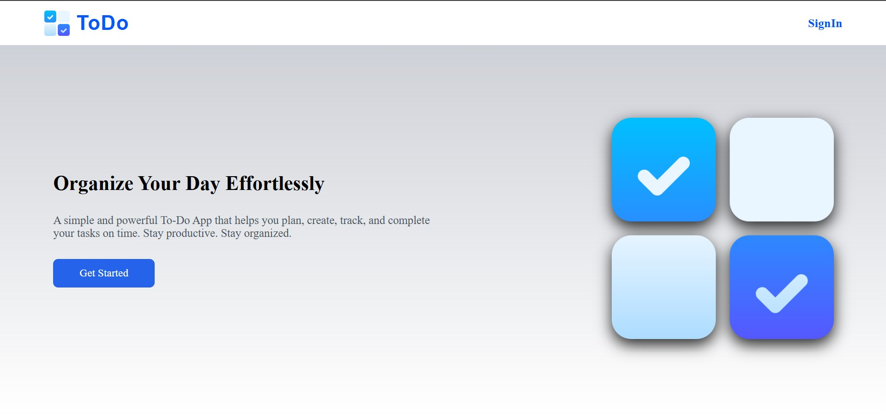
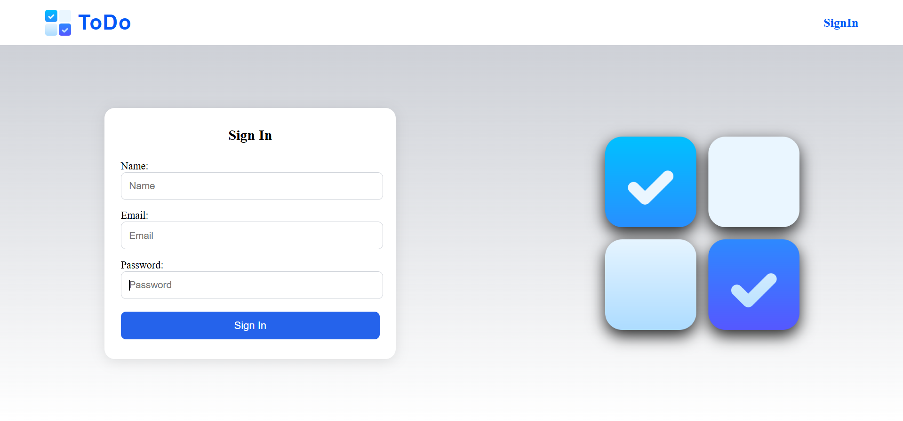
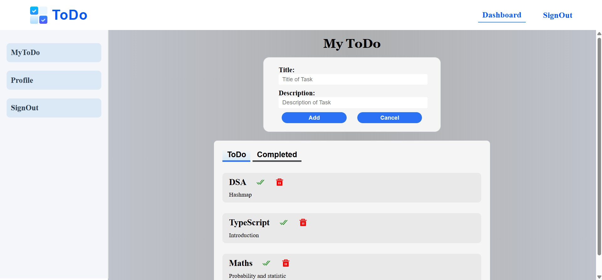
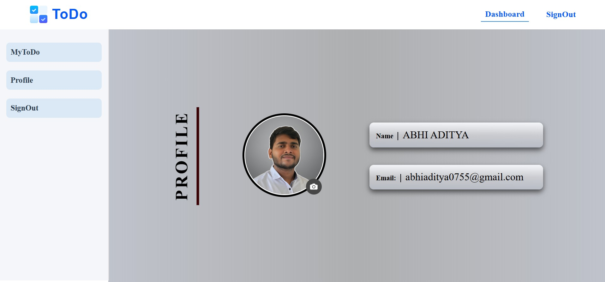

# 📌 ToDo App – React (Vite)  
A clean, modern, and responsive **To-Do Management Web App** built using **React + Vite**, featuring task creation, completion tracking, profile section, authentication UI, and a dashboard-based layout.

This app is designed to help users **organize daily tasks effortlessly** with a smooth, intuitive UI and structured component architecture.

---

## 🚀 Live Demo  


---

## 🖼️ UI Screenshots  

### 🔹 Home Page  


### 🔹 Sign In Page  


### 🔹 Dashboard Page  


### 🔹 Profile Page  



## ✨ Features

✔️ Elegant UI  
✔️ Add, edit, delete, and complete tasks  
✔️ Dashboard with tabs: **ToDo** and **Completed**  
✔️ Profile section with **image upload + localStorage persistence**  
✔️ Sidebar navigation  
✔️ Authentication UI (name, email, password form)  
✔️ Context API implementation for user/auth state  
✔️ Vite for fast development  

---

## 🛠️ Tech Stack

        | Category | Technologies |
        |---------|--------------|
        | Frontend | React, Vite |
        | Styling | CSS3 |
        | State Management | React Context API |
        | Routing | React Router |
        | Icons | react-icons |

---

## 📁 Folder Structure

```
TODO/
├── public/
│   └── To-do.png
├── src/
│   ├── assets/
│   │   └── Screenshots/
│   │       ├── home.png
│   │       ├── signin.png
│   │       ├── dashboard.png
│   │       └── profile.png
│   ├── Components/
│   │   ├── Navbar.jsx
│   │   └── Navbar.css
│   ├── Context/
│   │   ├── AuthContext.jsx
│   │   └── AuthStates.jsx
│   ├── DashboardCompnent/
│   │   ├── Herosection.jsx
│   │   ├── Herosection.css
│   │   ├── Profile.jsx
│   │   ├── Profile.css
│   │   ├── Sidebar.jsx
│   │   └── Sidebar.css
│   ├── Pages/
│   │   ├── Home.jsx
│   │   ├── Home.css
│   │   ├── SignIn.jsx
│   │   ├── SignIn.css
│   │   ├── Dashboard.jsx
│   │   └── Dashboard.css
│   ├── App.jsx
│   ├── main.jsx
│   └── index.css
├── README.md
├── package.json
├── vite.config.js
└── vercel.json
